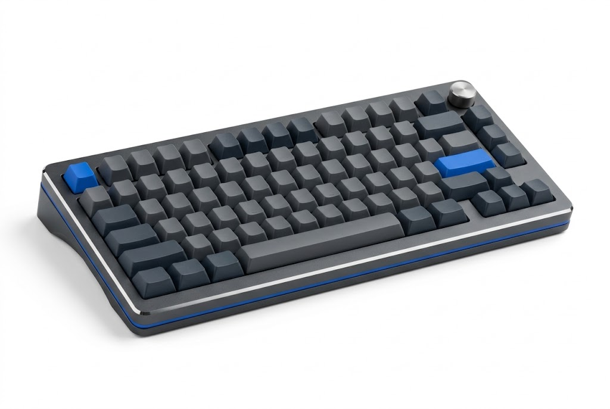
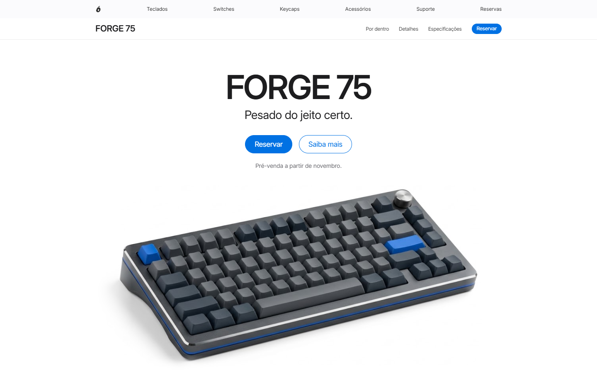

  <picture>
    <source media="(prefers-color-scheme: dark)" srcset="public/mango-branco.svg">
    
  </picture>

<h1 align="center">FORGE 75</h1>

<b>Pesado do jeito certo.</b>

  Teclado mecânico 75% em alumínio usinado. 
  Gasket mount. Hot-swap. 8000 Hz.

  

 

<table>
  <tr>
    <td width="33%" valign="top">
      <h3>Um bloco de alumínio.</h3>
      O case sai inteiro de 1,8 kg de alumínio usinado. Não torce, não range e não sai do lugar.
    </td>
    <td width="33%" valign="top">
      <h3>Gasket mount.</h3>
      A plate flutua sobre Poron. Cada tecla pousa macio, e o som fica fundo.
    </td>
    <td width="33%" valign="top">
      <h3>Hot-swap.</h3>
      Os 82 switches saem sem solda. Troque o som e o peso quando quiser.
    </td>
  </tr>
</table>

 

<h2 align="center">Por dentro, cada camada tem um motivo.</h2>

O site desmonta o teclado em 3D, camada por camada, enquanto você rola.

| | Camada | Por que existe |
|:-:|---|---|
| 1 | **Keycaps de PBT** | Plástico fosco que não brilha com o uso. Perfil Cherry, a altura acompanha os dedos. |
| 2 | **Moldura e knob** | O topo do case, com a faixa prateada polida. O knob de alumínio escovado vai preso nela. |
| 3 | **Switches** | Corpo escuro, haste azul. Saem e entram sem solda. |
| 4 | **Plate de alumínio** | 1,5 mm. Segura cada switch e define o quanto o teclado cede. |
| 5 | **Gaskets de Poron** | Seguram o impacto. A digitação fica macia e o som desce de tom. |
| 6 | **PCB** | 82 soquetes hot-swap, polling de 8000 Hz. |
| 7 | **Espuma** | 3,5 mm. Preenche o vazio do case e tira o eco. |
| 8 | **Base em cunha** | Já vem inclinada a 6°, com a faixa azul na frente e a USB-C atrás. |

 

<table>
  <tr>
    <td align="center" width="25%"><h2>8000 Hz</h2>Polling rate</td>
    <td align="center" width="25%"><h2>0,125 ms</h2>Da tecla até a tela</td>
    <td align="center" width="25%"><h2>1,8 kg</h2>De alumínio</td>
    <td align="center" width="25%"><h2>6°</h2>De inclinação, no próprio case</td>
  </tr>
</table>

 

<h2 align="center">Um lançamento contado pelo scroll.</h2>

  

Direção visual da página de lançamento.

 

<h2 align="center">Especificações.</h2>

| | |
|---|---|
| **Layout** | 75%, 82 teclas + knob |
| **Case** | Alumínio usinado, 2 peças |
| **Montagem** | Gasket mount, Poron |
| **Plate** | Alumínio, 1,5 mm |
| **Switches** | Hot-swap, sem solda |
| **Keycaps** | PBT, perfil Cherry |
| **Dimensões** | 325 × 135 mm |
| **Altura** | 20 mm na frente, 33 mm atrás |
| **Peso** | 1,8 kg |
| **Conexão** | USB-C |

 

  <picture>
    <source media="(prefers-color-scheme: dark)" srcset="public/mango-branco.svg">
    
  </picture>

<h3 align="center">Sobre a Mango</h3>

  A Mango é uma empresa fictícia de tecnologia, uma paródia da Apple. 
  O FORGE 75 é o primeiro produto dela. A próxima parada é a loja Mango.

 

Projeto de portfólio. Mango e FORGE 75 são fictícios e não têm relação com a Apple. Números e especificações são ilustrativos.

Feito com React, Three.js e GSAP.

