<p align="center">
  
</p>

<p align="center">
  <a href="#-a-mango"><b>A Mango</b></a> ·
  <a href="#-mangobook-pure"><b>MangoBook Pure</b></a> ·
  <a href="#-a-página"><b>A página</b></a> ·
  <a href="#-como-foi-feito"><b>Como foi feito</b></a> ·
  <a href="#-rodar-localmente"><b>Rodar</b></a> ·
  <a href="#-autor"><b>Autor</b></a>
</p>

<p align="center">
  
  
  
  
  
  
</p>

<br>

> [!NOTE]
> **Mango é uma marca fictícia.** Este repositório é uma peça de portfólio: uma paródia de página de lançamento de produto, sem nenhuma relação com a Apple. Preços, números e produtos são inventados.

<br>

## 🥭 A Mango

<table>
<tr>
<td width="58%" valign="top">

### Uma empresa que pensa doce.

A Mango nasceu de uma pergunta simples: **e se a tecnologia tivesse gosto?**

Em vez de uma maçã mordida, uma manga cortada ao meio, com o caroço à mostra. É a nossa ideia de transparência: mostrar o que tem por dentro. O logo, o **"D · Caroço"**, é exatamente isso.

A Mango faz objetos que dão vontade de pegar na mão. Alumínio na cor, das bordas às teclas. Nada de cinza por obrigação.

</td>
<td width="42%" align="center" valign="middle">
<picture>
  <source media="(prefers-color-scheme: dark)" srcset="public/mango-branco.svg">
  
</picture>
<br><sub><b>D · Caroço</b><br>a manga com o caroço vazado</sub>
</td>
</tr>
</table>

### A Mango não tem uma cor. Tem todas.

<p align="center">
  
</p>

| Princípio | O que significa |
|:--|:--|
| 🍋 **Doce, nunca enjoativo** | Cor e personalidade com a contenção de uma página de lançamento de verdade. |
| 🔍 **Mostrar o caroço** | O produto é o protagonista; a interface sai da frente. |
| ✋ **Dá vontade de tocar** | Cada interação responde: vidro, molas, transições que assentam devagar. |
| 🌱 **Doce com o planeta** | Alumínio reciclado e embalagem de fibra (pelo menos na ficção). |

<details>
<summary><b>A família Mango</b> (clique para abrir)</summary>
<br>

| Produto | O que é |
|:--|:--|
| 💻 **MangoBook Pure** | O notebook leve e colorido. O protagonista deste projeto. |
| 💻 **MangoBook Prime** | O irmão maior: 15,3", chip Palmer Max. |
| 📱 **Mangophone** | O celular que conversa com o MangoBook. |
| 📲 **Mangopad** | O tablet. |
| 🧠 **Chip Palmer** | O processador, batizado com uma variedade de manga brasileira. |
| ✨ **Mango Intelligence** | A IA que roda no próprio aparelho. |
| 🖥️ **MangoOS** | O sistema. Simples desde o primeiro clique. |

</details>

<br>

## 💻 MangoBook Pure

<p align="center"><b>Doce por fora. Rápido por dentro.</b></p>

<p align="center">
  
</p>

> O nome vem de **purê** de manga, sem o "ê". Leve, macio e feito de uma fruta só.

<table>
<tr>
<td align="center" width="25%"><h2>13,6"</h2><sub>tela Pure Retina</sub></td>
<td align="center" width="25%"><h2>18 h</h2><sub>de bateria</sub></td>
<td align="center" width="25%"><h2>1,2 kg</h2><sub>alumínio reciclado</sub></td>
<td align="center" width="25%"><h2>0 dB</h2><sub>sem ventoinha</sub></td>
</tr>
</table>

<br>

## 🎬 A página

Uma página de lançamento de produto, no estilo das páginas da Apple, com **15 seções** contadas pelo scroll.

<table>
<tr>
<td width="50%">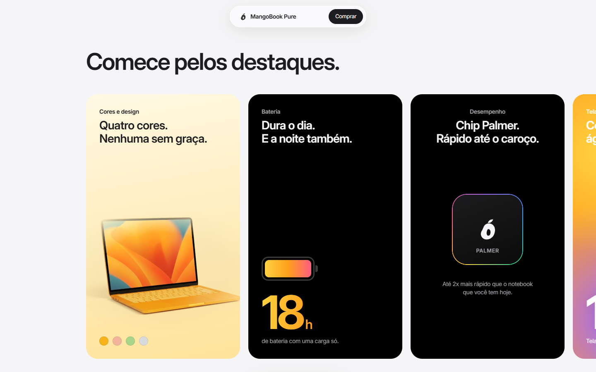<br><b>Comece pelos destaques.</b><br><sub>Carrossel de 7 cards com avanço automático a cada 8 s e pontos de vidro que enchem com o tempo.</sub></td>
<td width="50%">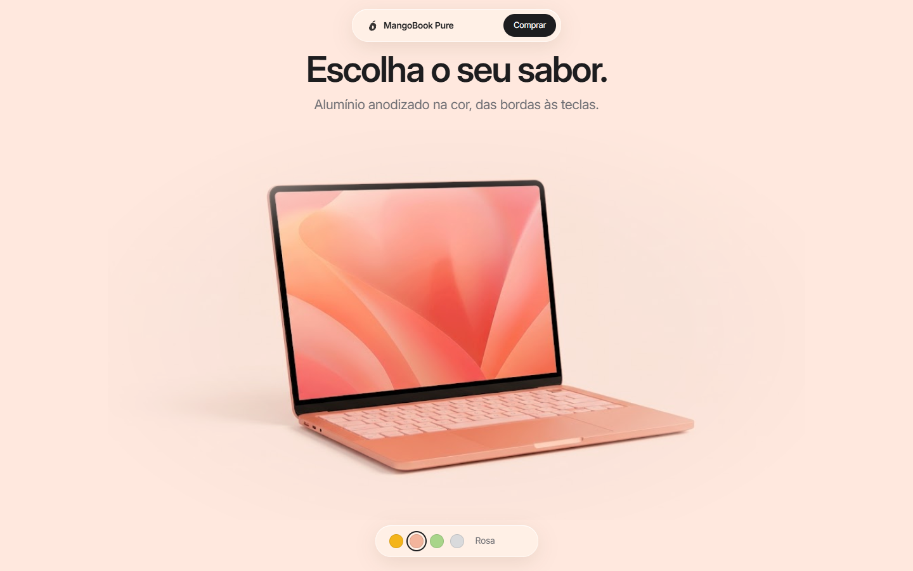<br><b>Escolha o seu sabor.</b><br><sub>A seção inteira tinge na cor escolhida e o notebook troca com um fade curto.</sub></td>
</tr>
<tr>
<td width="50%">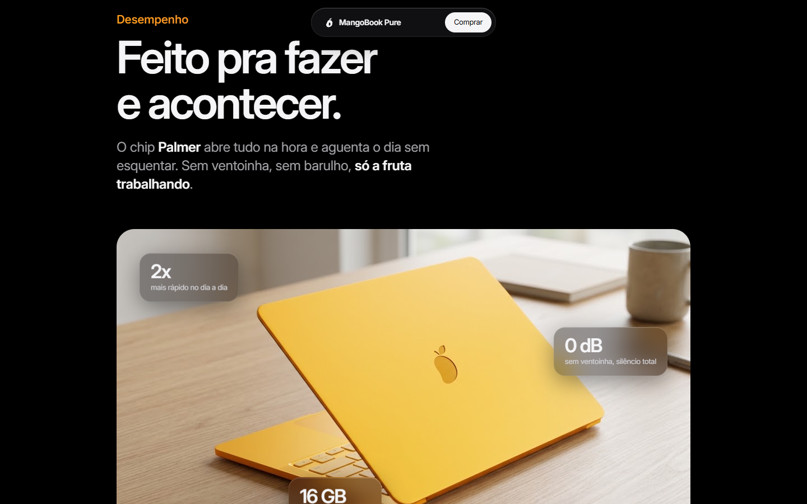<br><b>Feito pra fazer e acontecer.</b><br><sub>Cartões de vidro flutuando sobre a foto e abas de uso: estudar, trabalhar, criar e jogar.</sub></td>
<td width="50%">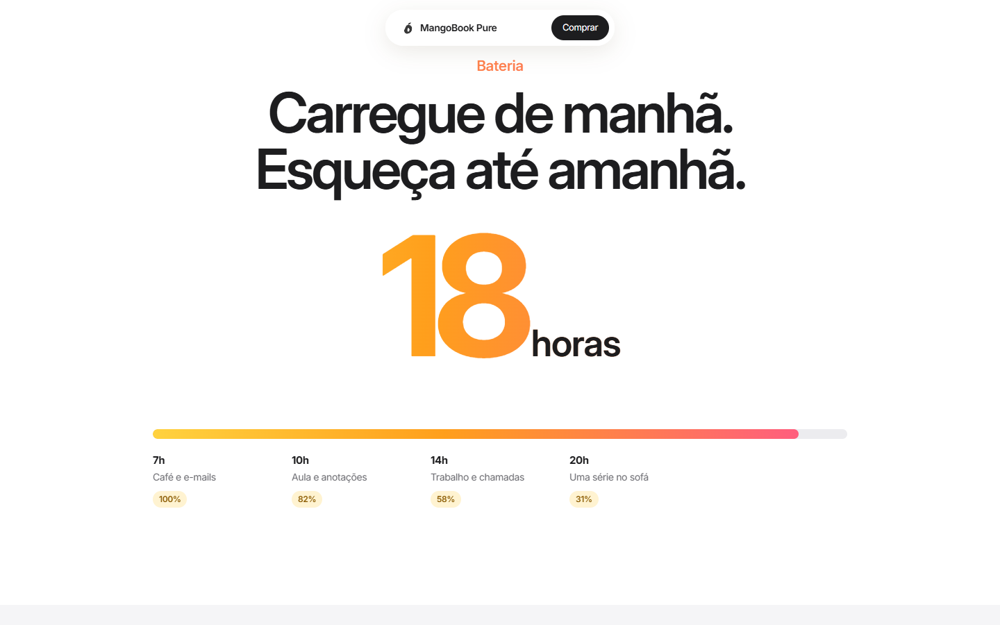<br><b>Carregue de manhã. Esqueça até amanhã.</b><br><sub>O número conta até 18 e a linha do dia enche das 7h à 1h.</sub></td>
</tr>
<tr>
<td width="50%">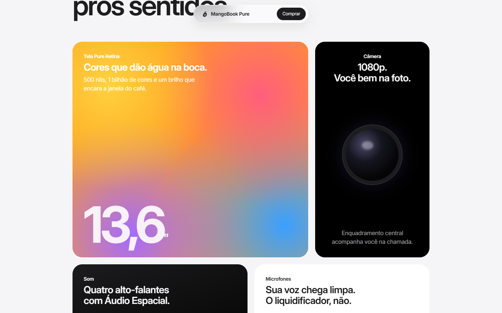<br><b>Uma festa pros sentidos.</b><br><sub>Bento com equalizador animado e ondas de microfone.</sub></td>
<td width="50%">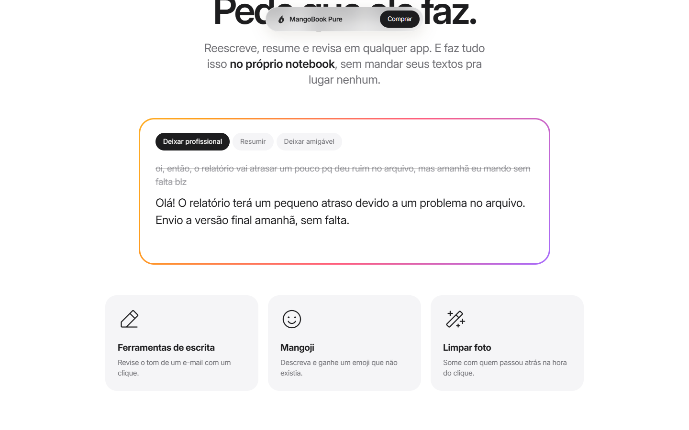<br><b>Pede que ele faz.</b><br><sub>Uma mensagem bagunçada é reescrita letra por letra, em três tons.</sub></td>
</tr>
<tr>
<td width="50%">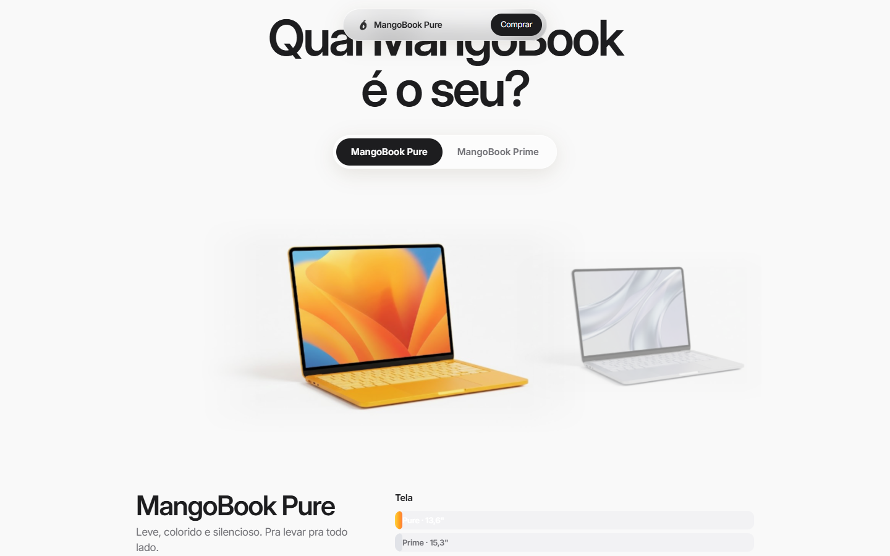<br><b>Qual MangoBook é o seu?</b><br><sub>Comparador interativo: o modelo escolhido vem pra frente e as barras mostram a diferença.</sub></td>
<td width="50%">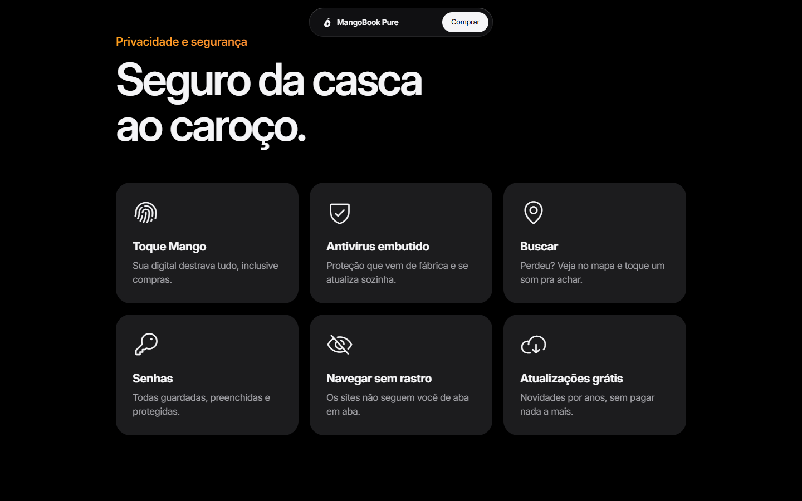<br><b>Seguro da casca ao caroço.</b><br><sub>Ícones de traço fino que acendem cada um numa cor da marca.</sub></td>
</tr>
</table>

<details>
<summary><b>Todas as 15 seções, em ordem</b></summary>
<br>

| # | Seção | O que acontece |
|:-:|:--|:--|
| 1 | **Abertura** | Foto em tela cheia e barra de compra em vidro com as quatro cores. |
| 2 | **Destaques** | Carrossel de cards claros, escuros e em degradê. |
| 3 | **Amor à primeira fruta** | As quatro cores juntas. |
| 4 | **Escolha o seu sabor** | Seletor de cor com banho de cor. |
| 5 | **Desempenho** | Chip Palmer, cartões de vidro e abas de uso. |
| 6 | **Bateria** | Contador até 18 h e a linha de um dia inteiro. |
| 7 | **Tela, câmera e som** | Bento com equalizador e microfones. |
| 8 | **Mango Intelligence** | Demo de reescrita ao vivo. |
| 9 | **MangoOS** | Sanfona que reorganiza a tela ao lado. |
| 10 | **Mango + Mangophone** | Seis recursos de continuidade. |
| 11 | **Privacidade e segurança** | Seis cards em fundo preto. |
| 12 | **Motivos pra comprar** | Cards no estilo Apple que abrem com um "+". |
| 13 | **Qual MangoBook é o seu?** | Comparador Pure × Prime. |
| 14 | **Meio ambiente** | Três números de impacto. |
| 15 | **Chamada final e rodapé** | Com o aviso de paródia, sempre. |

</details>

<br>

## 🧪 Como foi feito

O visual foi decidido **antes** do código. Cada escolha virou uma página em [`escolhas/`](escolhas/) com várias opções lado a lado, testadas no navegador.

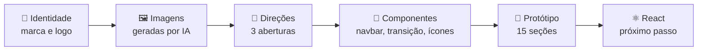

| Decisão | Opções testadas | Escolha |
|:--|:--|:--|
| **Abertura** | Neo clássico · Imersivo · Editorial | [Imersivo](escolhas/abertura-notebook.html) |
| **Navbar** | 6 variações de vidro | [Ilha que encolhe](escolhas/navbars.html) ao rolar |
| **Troca de cor** | 7 transições | [Banho de cor](escolhas/transicao-cores.html) |
| **Ícones** | 5 estilos | [Traço fino, uma cor só](escolhas/icones.html) |

<details>
<summary><b>Detalhes de interação</b></summary>
<br>

- **Ilha que encolhe:** a navbar de vidro mostra tudo no topo e encolhe para "nome + Comprar" ao rolar, em etapas (links somem, a pílula fecha, o nome entra). Reabre no hover e no foco do teclado. Fica escura sobre seções pretas.
- **Banho de cor:** escolher uma cor tinge a seção inteira no tom da fruta.
- **Motion com propósito:** curvas que assentam devagar (`cubic-bezier(0.32, 0.72, 0, 1)`), sem bounce. Tudo respeita `prefers-reduced-motion`.
- **Acessibilidade:** abas e seletores com papel ARIA, navegação por setas e foco visível.

</details>

<details>
<summary><b>Por trás: a parte 1, um teclado em 3D</b></summary>
<br>

Antes do notebook, o projeto era o **Mango FORGE 75**, um teclado mecânico com modelo 3D procedural em Three.js, que se desmontava em 8 camadas conforme o scroll. Esse código continua no repositório (`src/teclado`, `src/3d`) e traz:

- **Roteiro de poses** como funções puras do progresso do scroll, com testes (`node --test`).
- **"Dono do palco"**: só a seção no meio da tela controla a câmera 3D, com troca suave entre seções.
- Fallbacks para movimento reduzido e navegadores sem WebGL.

</details>

<br>

## 🛠️ Stack

<table>
<tr>
<td align="center" width="16%"><br><sub><b>React 19</b></sub></td>
<td align="center" width="16%"><br><sub><b>Vite 8</b></sub></td>
<td align="center" width="16%"><br><sub><b>Three.js + R3F</b></sub></td>
<td align="center" width="16%"><br><sub><b>GSAP</b></sub></td>
<td align="center" width="16%"><br><sub><b>CSS moderno</b></sub></td>
<td align="center" width="16%"><br><sub><b>node --test</b></sub></td>
</tr>
</table>

Ícones: [Phosphor](https://phosphoricons.com) (Light). Fonte: [Inter](https://rsms.me/inter/). Imagens do produto: geradas por IA.

<br>

## 🚀 Rodar localmente

```bash
git clone https://github.com/guilhermesolagarcia/Projeto-Hardware.git
cd Projeto-Hardware
npm install
npm run dev
```

| Endereço | O que abre |
|:--|:--|
| `localhost:5173/escolhas/pure.html` | 🥭 O protótipo completo do MangoBook Pure |
| `localhost:5173/escolhas/` | As páginas de escolha de design |
| `localhost:5173/` | O site React da parte 1 (teclado 3D) |

```bash
npm test        # testes do roteiro 3D e do dono do palco
npm run build   # build de produção
```

<details>
<summary><b>Estrutura de pastas</b></summary>
<br>

```
Projeto-Hardware/
├── escolhas/          páginas de decisão de design + protótipo (pure.html)
├── mango-book/        imagens do MangoBook Pure geradas por IA
├── public/            logo da Mango (claro e escuro)
├── src/
│   ├── 3d/            palco, roteiro de poses e estado (com testes)
│   ├── cenas/         seções do site React
│   ├── teclado/       modelo 3D procedural do FORGE 75
│   └── ui/            barras e rodapé
└── docs/              specs, planos e imagens deste README
```

</details>

<br>

## 🗺️ Próximos passos

- [x] Identidade da Mango e logo
- [x] Protótipo completo do MangoBook Pure (15 seções)
- [ ] Fotos do produto com fundo transparente e em alta resolução
- [ ] Imagens próprias para os destaques e para "Amor à primeira fruta"
- [ ] Levar o protótipo para React, com o scroll e o palco da parte 1
- [ ] Publicar online

<br>

## 👋 Autor

<table>
<tr>
<td width="120" align="center">

</td>
<td>

### Guilherme Sola Garcia

Este projeto é parte do meu **portfólio**: design de produto, motion e 3D na web.

[](https://github.com/guilhermesolagarcia)

</td>
</tr>
</table>

<br>

---

<p align="center">
  <sub>Mango, MangoBook Pure, Mangophone, chip Palmer e MangoOS são uma paródia fictícia, criada como projeto de portfólio, sem nenhuma relação com a Apple Inc.<br>Preços, números e produtos são ilustrativos.</sub>
</p>

<p align="center">
  <picture>
    <source media="(prefers-color-scheme: dark)" srcset="public/mango-branco.svg">
    
  </picture>
  <br>
  <sub>Feito com 🥭 por <b>Guilherme Sola Garcia</b></sub>
</p>
